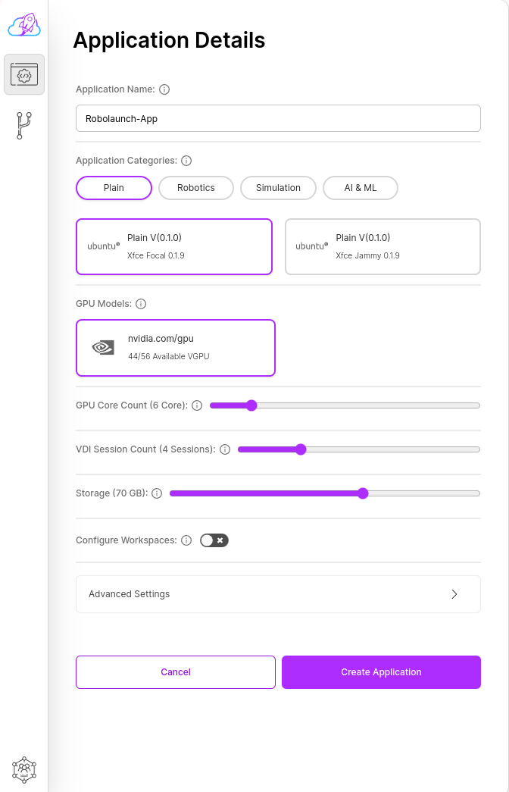
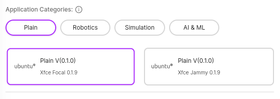
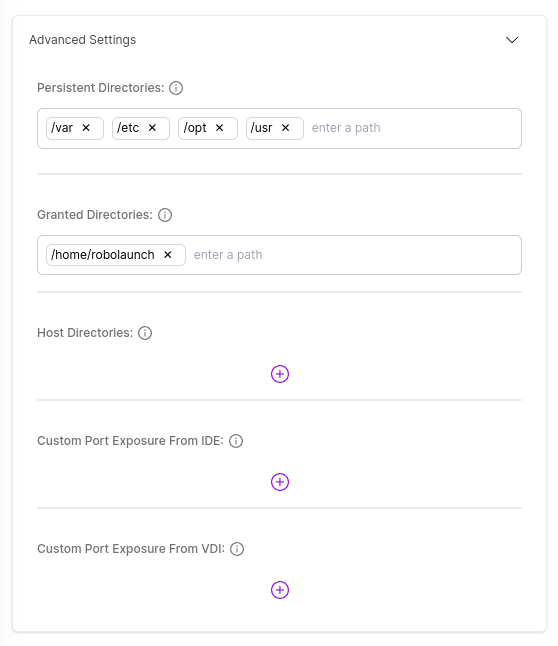
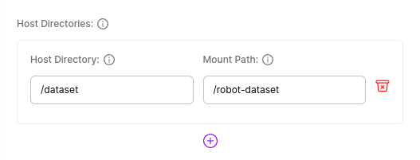
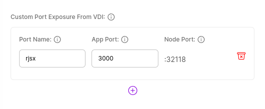

# Details (Step 1)

Details form is the form that contains all the main settings and configurations of your application to be created.

### Application Name

You can specify the name of your application here.

### Application Categories

You can choose the application category and application here.

### GPU Models

You can choose the GPU model here.

If you have `MIG` support architecturally, you need a minimum of 1 Core to create an application. Other than that, you will always need 2 Cores.

### GPU Core Count

Here you can determine how many cores your application will use.

The number of cores depends on the preferred GPU model. The number of available cores of the preferred GPU model is the maximum number of cores for the app to be created.

### VDI Session Count

Here you can determine how many people can connect to your application's VDI service at the same time.

### Storage

You can determine how much storage space will be allocated for your application here.

### Configure Workspaces

If you want to specify workspaces, you can do so here.

## Advanced Settings

It contains advanced settings of the application such as Directories or Port.

### Persistent Directories

Here you can persist directorys on the application.

As in the example in the image, `/var`, `/etc`, `/opt` and `/usr` directories are added as must and default.

### Granted Directories

Here you can specify the directories that the user needs to access.

As in the example in the image, `/home/robolaunch` directory are added as must and default.

### Host Directories

You can link a directory on the host to the directory specified in the application here.

As in the example in the image, the `/dataset` directory is mounted to the `/robot-dataset` directory in the application.

### Custom Port Exposure From IDE

Here you can specify the custom ports you want your application running in the IDE service to expose.

As in the example in the image, the `8077` port named `java` can be output from the `32549` port.

### Custom Port Exposure From VDI

Here you can specify the custom ports you want your application running in the VDI service to expose.

As in the example in the image, the `3000` port named `rjsx` can be output from the `32118` port.
