# Details (Step 1)

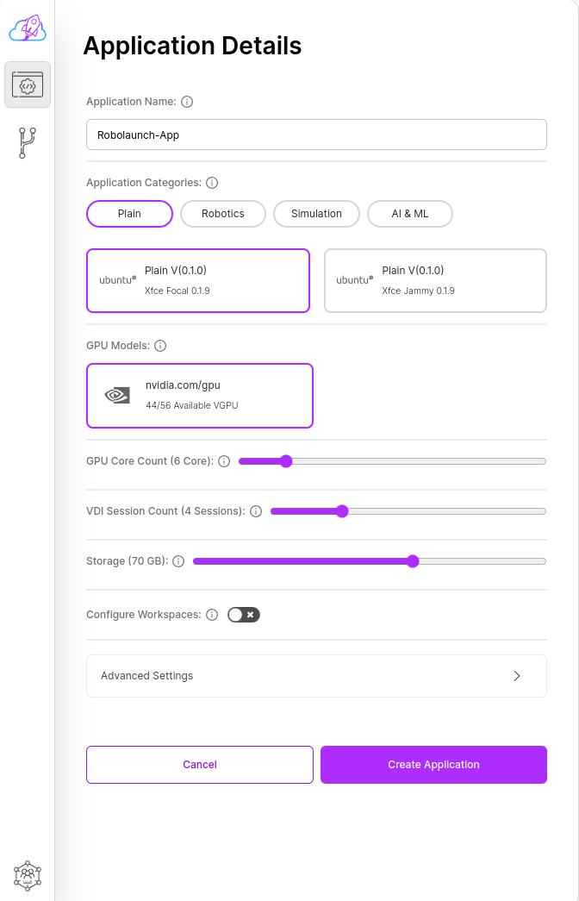

Details form is the form that contains all the main settings and configurations of your application to be created.

### Application Name

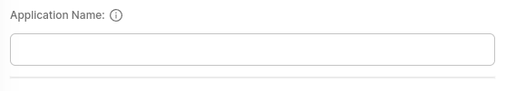

You can specify the name of your application here.

### Application Categories

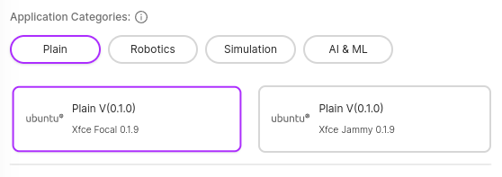

You can choose the application category and application here.

### GPU Models

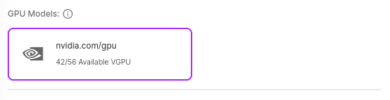

You can choose the GPU model here.

### GPU Core Count

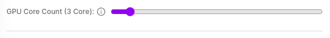

Here you can determine how many cores your application will use.

### VDI Session Count

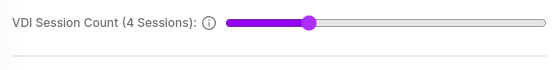

Here you can determine how many people can connect to your application's VDI service at the same time.

### Storage

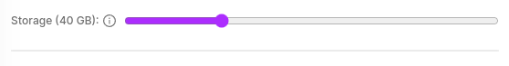

You can determine how much storage space will be allocated for your application here.

### Configure Workspaces

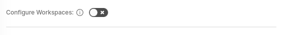

If you want to specify workspaces, you can do so here.

## Advanced Settings

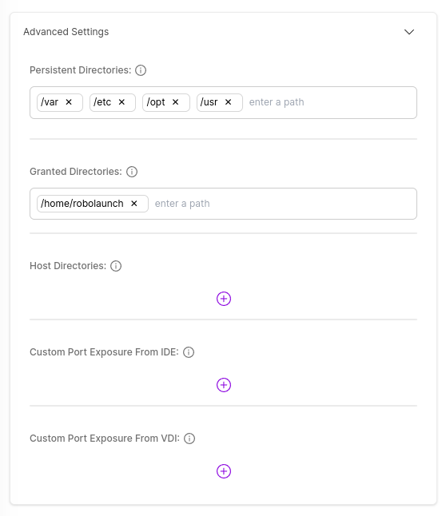

It contains advanced settings of the application such as Directories or Port.

### Persistent Directories

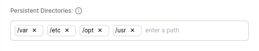

Here you can persist directorys on the application.

As in the example in the image, `/var`, `/etc`, `/opt` and `/usr` directories are added as must and default.

### Granted Directories

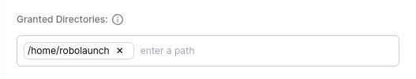

Here you can specify the directories that the user needs to access.

As in the example in the image, `/home/robolaunch` directory are added as must and default.

### Host Directories

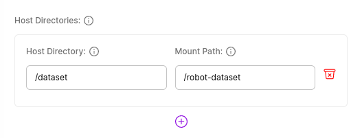

You can link a directory on the host to the directory specified in the application here.

As in the example in the image, the /dataset directory is mounted to the /robot-dataset directory in the application.

### Custom Port Exposure From IDE

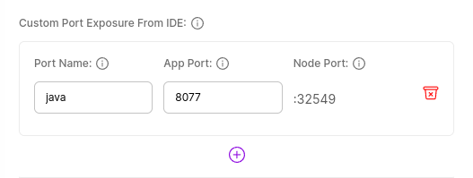

Here you can specify the custom ports you want your application running in the IDE service to expose.

As in the example in the image, the `8077` port named `java` can be output from the `32549` port.

### Custom Port Exposure From VDI

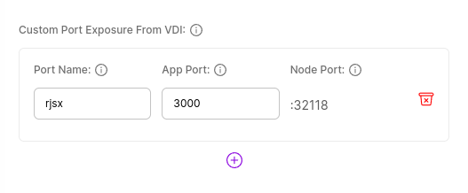

Here you can specify the custom ports you want your application running in the VDI service to expose.

As in the example in the image, the `3000` port named `rjsx` can be output from the `32118` port.
