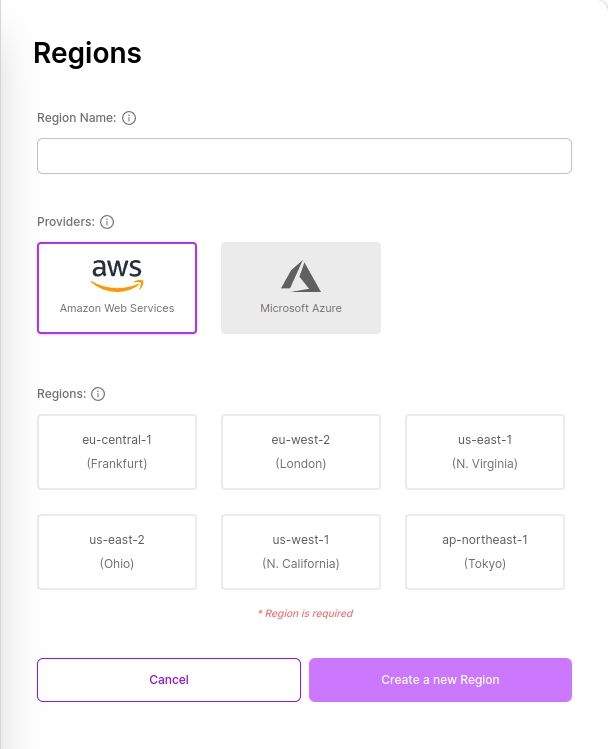

# Create Region

To create a Region, all you need is to determine a Region name.

- Click on the "Region" button in the sidebar to open the list of Regions. The current Regions you have will be listed in the displayed tab.

- At the bottom of the opened tab, click on the "Create Region" button.

- If you receive a prompt asking you to select an organization, you need to click on the desired organization to determine under which organization the Region will be located. After completing the selection process, click the "Create Region" button again.

- After clicking, enter your desired Region name in the "region name" field in the form that appears.

- Then select the region you want.

- Finally, click on the "Create a new Region" button.

After clicking, you will be redirected to the Regions list. In the displayed list, you can view the Region you created.
