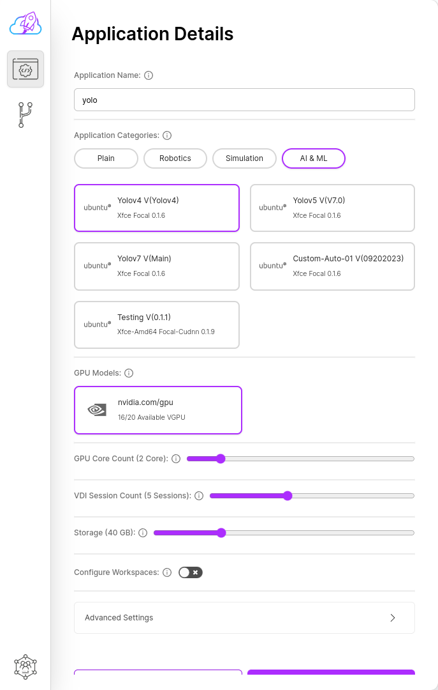

# Yolo

To create a Yolo, you need is to few click.

## Creation Flow

To create a Yolo, you need is to few click.

- Click on the "Applications" button in the sidebar to open the list of applications. The current applications you have will be listed in the displayed tab.

- At the bottom of the opened tab, click on the "Create Application" button.

- If you receive a prompt asking you to select an Organization, Region, Cloud Instance or Namespace, you need to click on the desired object to determine under which Organization, Region, Cloud Instance or Namespace. After completing the selection process, click the "Create Application" button again.

- After clicking, enter your desired application name in the "Application name" field in the form that appears.

- Then select "AI & ML" option of application categories.

- And select the app version you want.

- Fill in all remaining fields according to your needs.

- Finally, click on the "Create Application" button.

After clicking, you will be redirected to the application list. In the displayed list, you can view the aplication you created.
