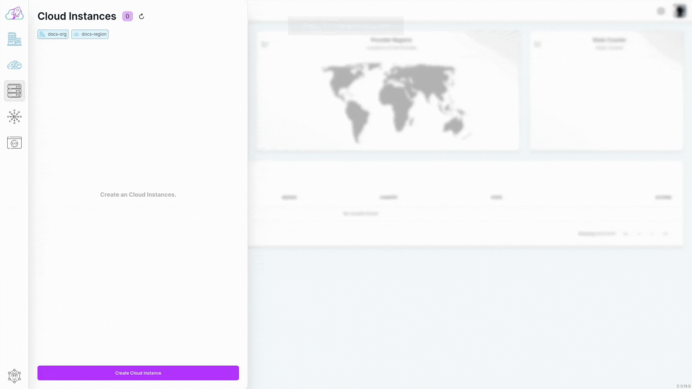
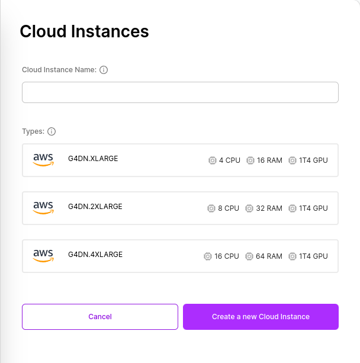

# Create

## Creation Flow

To create a Cloud Instance, all you need is to determine a Cloud Instance name.

- Click on the "Instance" button in the sidebar to open the list of Instances. The current Instances you have will be listed in the displayed tab.

- At the bottom of the opened tab, click on the "Create Cloud Instance" button.

- If you receive a prompt asking you to select an organization or Region, you need to click on the desired object to determine under which organization or Region the Cloud Instance will be located. After completing the selection process, click the "Create Cloud Instance" button again.

- After clicking, enter your desired Cloud Instance name in the "Cloud Instance Name" field in the form that appears.

- In the "Types" section, select your preference from the available resource models for the instance to be created.

- Finally, click on the "Create a new Cloud Instance" button.

After clicking, you will be redirected to the Cloud Instances list. In the displayed list, you can view the Cloud Instance you created.
