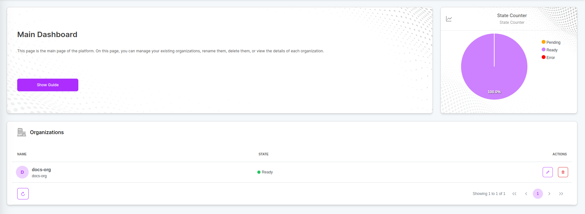
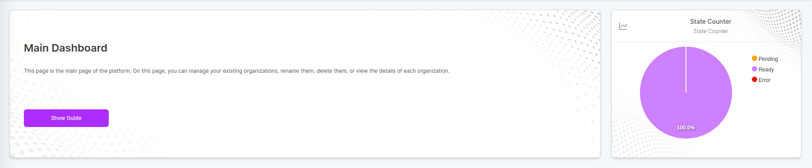
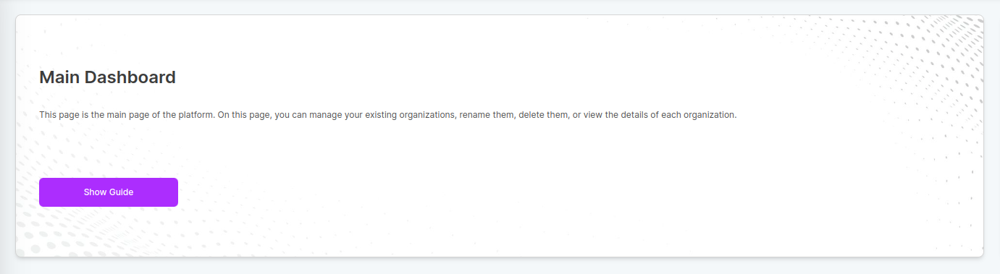
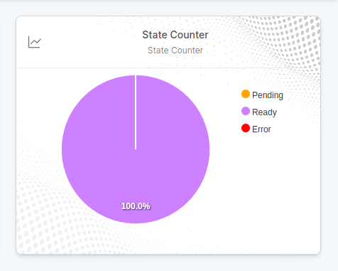
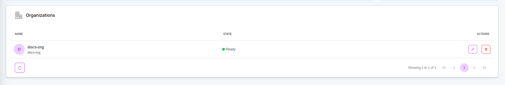

# Dashboard

The organization dashboard provides detailed information about the organizations you have.

It basically consists of 2 sections. Widgets and general table.

## Widgets

Widgets provide information about objects on the dashboard.

### Information Widget

The information widget explains which objects are available on the current dashboard and how they can be managed. You can run the auxiliary guide on this subject with the `Show Guide` button.

### State Widget

State Widget is a pie widget that visualizes the states of current objects and possible errors.

## Table

General Table displays detailed information of existing objects. You can manage your objects with the `Actions` tab.
