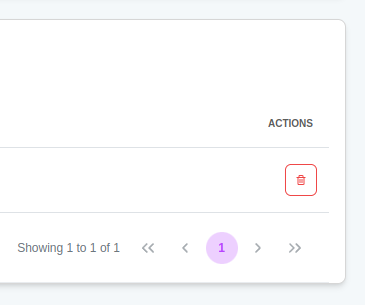

# Delete

## Deletion Flow

All you need to delete an region is just a few clicks.

- Go to the dashboard where your regions are. (You can get there by clicking the organization icon in the sidebar and click the `>` button on any item.)

- Click on the button with the trash icon on the right side of the opened table rows.

- After clicking, confirm the popup that appears.

Finally, the region chart will be refreshed. You can view existing regions in the displayed table.
