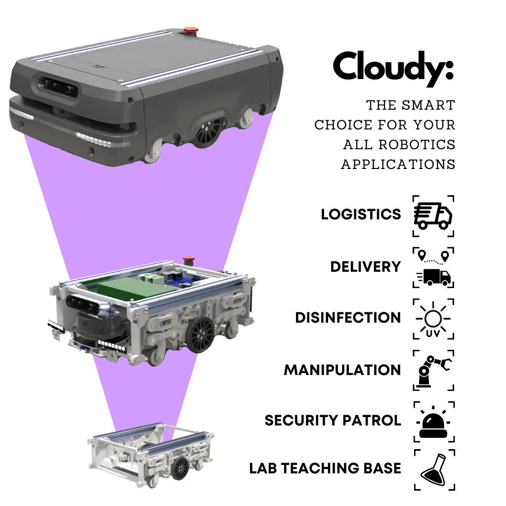

# Cloudy

Cloudy Mini - AGV is the ultimate solution for all your indoor robotics needs. Whether you're looking to create a delivery robot, a logistics robot, a disinfection robot, a security patrol robot, or anything in between, Cloudy is the perfect starting point.

At the heart of Cloudy Mini - AGV is its powerful and flexible modular design. With its customizable hardware and open-source software, Cloudy can be easily adapted to fit any use case. Its modular design also means that you can add or remove components as needed, making it a versatile base for all kinds of indoor robotics projects.

## Open-Source

All software components and hardware design is open source and hosted on GitHub.

## Cost-Effective

Cloudy is an affordable mobile robot and you can purchase it from our store assembled or unassembled.

## Easy to Use

Cloudy can be set up easily and allows you to start developing instantly to create.

## Perfect for Learning

Designed to help students/robotics enthusiats learn about robotics and coding.

## State-of-Art Nav Stack

Providing the ability to accurately and efficiently navigate in the complex environments.

## Advance Support

You can leverage active support from both robolaunch Team and also open-source community of Cloudy.

## Benefits and Advantages

### Start Immediately

We offer a fully assembled version of Cloudy Mini - AGVfrom our store allow you to choose among different options. You can choose additional sensors (like LIDAR and stereo camera) and advantageous discounted robolaunch Cloud Robotics Platform plans. By following our detailed docs, tutorials and also leveraging robolaunch Platform capabilities, you can start developing your applications on Cloudy Mini -AGV with ease!

### Build it Yourself

In addition to the assembled Cloudy Mini - AGV, you can also built this robot by yourself 3D printing it and purchasing electronic parts from suppliers since it is fully open-source! By following our comprehensive docs and tutorials, you can assemble your very own robot in a fun way!

### Teaching, Learning, and Practicing Robotics

With help of modular and extensible design with also power robolaunch Platform, teaching and learning robotics in academy both for educators and students has never been easier!

### Support Open-Source

With our fully open-source ROS 2 robot, the possibilities are endless. Whether you're a student, teacher, hobbyist, or professional, we invite you to contribute your ideas and expertise to make Cloudy Mini - AGV the best it can be.

Join our community today and help us shape the future of robotics education. See Cloudy Mini - AGV's 3D models and GitHub for software design.

| **Technical Specifications** |                                         | **Components and Accessories** |                                                         |
| ---------------------------- | --------------------------------------- | ------------------------------ | ------------------------------------------------------- |
| **Dimensions (L x W x H)**   | Approx. 340 x 240 x 110 mm              | **Lights**                     | 8 Led Strip                                             |
| **Weight**                   | Approx. 4 kg                            | **Multiplexer**                | Adafruit tca9548a                                       |
| **Payload**                  | Approx. 20 kg                           | **Cables**                     | Ethernet panel mount, USB panel mount, HDMI panel mount |
| **Maximum Speed**            | 1 m/s                                   | **Motor Driver**               | DRV 8825                                                |
| **Operating Time**           | 2 hours                                 | **RF Receiver**                | Flysky ia6b (with no controller)                        |
| **Drive Power**              | 50W Peak                                | **Fan**                        | Fan ~ 60x60x15                                          |
| **Battery Voltage**          | 12V (6S1P)                              | **Drivers / APIs**             | ROS 2 Bridge, Kubernetes API                            |
| **Voltage Sources**          | 12V / 5V / 3.3V                         | **Voltage Regulator**          | Hobbywing / Matek Mini Power Hub                        |
| **Wheels**                   | Differential Drive                      | **Screen**                     | Oled Display 128x64                                     |
| **Sensors**                  | Voltage Sensor, Gesture-Distance Sensor | **SBC (Optional)**             | Orange Pi 5 8GB                                         |
| **Communication**            | Wifi                                    | **Operating System**           | Ubuntu 20.4                                             |
| **Microcontroller**          | Wemos D1 R32 (ESP32)                    | **Lidar (Optional)**           | YDLIDAR T-Mini Pro                                      |
| **Shield**                   | Arduino Uno CNC Shield                  | **Stereo Camera (Optional)**   | YDLIDAR OS30A                                           |
| **Lights**                   | 8 Led Strip                             |
