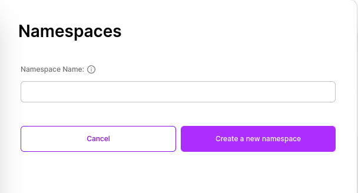

# Create

## Creation Flow

To create a Namespace, all you need is to determine a Namespace name.

- Click on the "Namespace" button in the sidebar to open the list of Namespaces. The current Namespaces you have will be listed in the displayed tab.

- At the bottom of the opened tab, click on the "Create Namespace" button.

- If you receive a prompt asking you to select an Organization, Robotics Cloud, or Cloud Instance, you need to click on the desired object to determine under which Organization, Robotics Cloud, or Cloud Instance the Namespace will be located. After completing the selection process, click the "Create Namespace" button again.

- After clicking, enter your desired Namespace name in the "Namespace name" field in the form that appears.

- Finally, click on the "Create a new Namespace" button.

After clicking, you will be redirected to the Namespace list. In the displayed list, you can view the Fleet you created.
