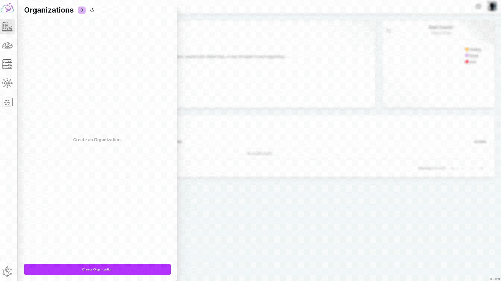

# Create

## Creation Flow

To create an organization, all you need is to determine an organization name.

- Click on the "Organization" button in the sidebar to open the list of organizations. The current organizations you have will be listed in the displayed tab.

- At the bottom of the opened tab, click on the "Create Organization" button.

- After clicking, enter your desired organization name in the "organization name" field in the form that appears.

- Finally, click on the "Create a new organization" button.

After clicking, you will be redirected to the organization list. In the displayed list, you can view the organization you created
