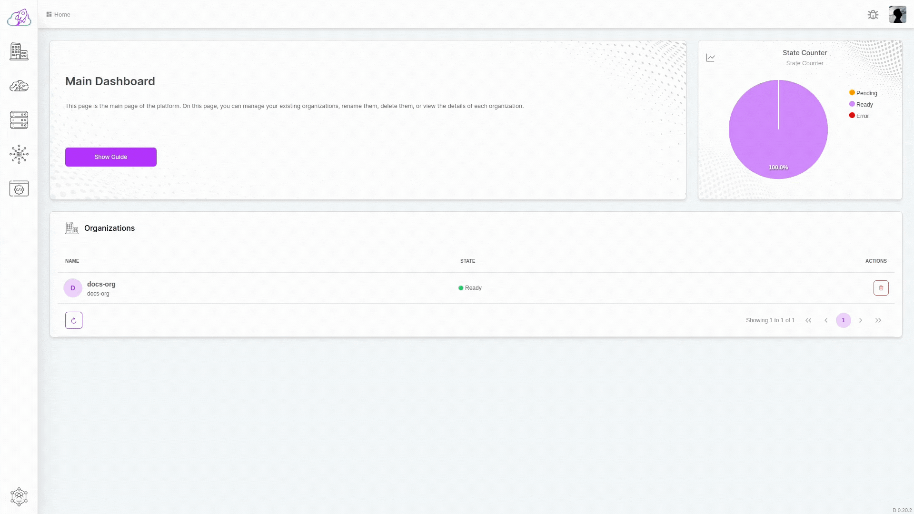
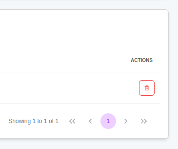

# Delete

## Deletion Flow

All you need to delete an organization is just a few clicks.

- Go to the dashboard where your organizations are. (You can go there by clicking on the robolaunch icon on the sidebar.)

- Click on the button with the trash icon on the right side of the opened table rows.

- After clicking, confirm the popup that appears.

Finally, the organization chart will be refreshed. You can view existing organizations in the displayed table.
