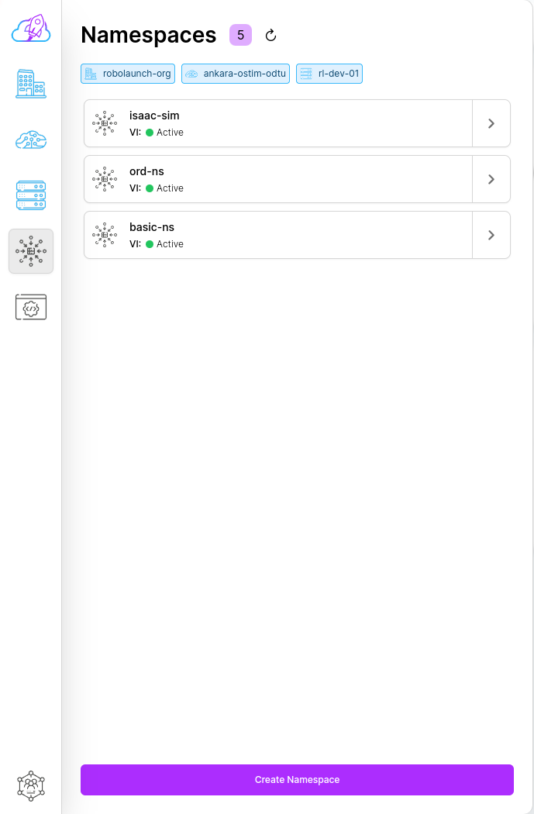
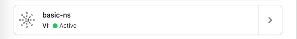

# Sidebar

## Sidebar

Sidebar component serves to list and filter existing objects. It consists of 5 sections in total. These are listed as;

- `Organizations`
- `Regions`
- `Instances`
- `Namespaces` or `Fleets`
- `Applications` or `Robots`

## Sidebar Item

Sidebar item component lists open section objects. If it is not selected, it appears gray; if it is selected, it appears blue. You can access the subpage of the relevant object with the `>` button on the right side.

## Logical Descriptions

- To choose one of the listed objects, simply click on it.

- To unselect, simply change the section and click on the selected item. The object clicked on and all objects under it will be deselected.

- If selected, the item and its icon on the sidebar will turn blue.

- If you are logically selecting an object, the sidebar will automatically switch to a list of sub-objects, since what you actually need is the objects underneath it.

- If the object to be listed has parent objects, it is mandatory to select the parent objects.

- If you want to see the objects contained in the listed object, you can click the `>` button to the right of the sidebar-item. If you click, you will be directed to the relevant page. For example, when I click on the `>` button of my organization named `rl-org`, I am directed to the page where all regions whose parent is `rl-org` are listed.
