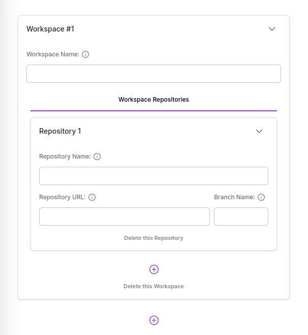
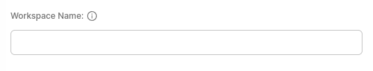

# Workspaces (Step 2)

Workspaces form is the form that contains all the workspaces and repositories of your application to be created.

### Workspaces Name

You can specify the name of your workspaces here.

## Repositories

You can add the git repositories that your Application application wants to include here.

### Repository Name

You can specify the name of your repository here.

### Repository URL

You can specify the URL of your repository here.

### Repository Branch

You can specify the branch of your repository here.
