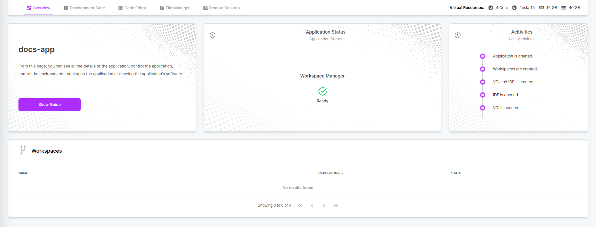
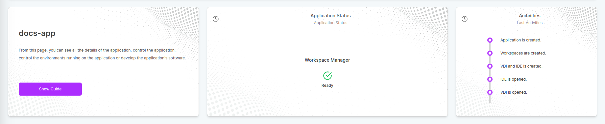
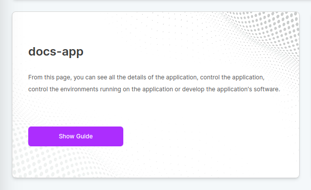
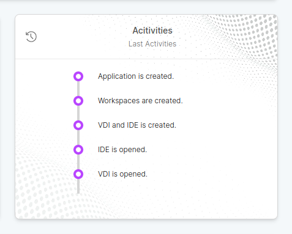

# Overview

## Overview

In the Overview tab, you can check the application status, view recent activities, and view workspaces, if any.

## Widgets

Widgets provide information about objects on the dashboard.

### Information Widget

The information widget explains which objects are available on the current dashboard and how they can be managed. You can run the auxiliary guide on this subject with the `Show Guide` button.

### Application Status Widget

Status Widget informs you about the status of your current application. If the installation process is not completed and you cannot go to other tabs, you can get information about the state by checking here.

### Activities Widget

The Activities Widget allows you to view current and recent transactions in your app.
