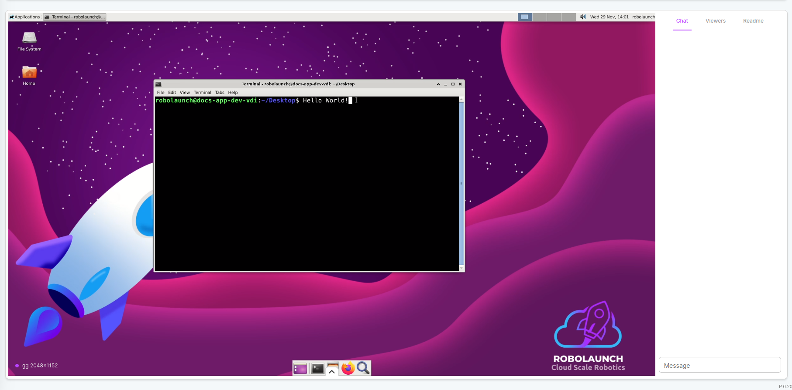
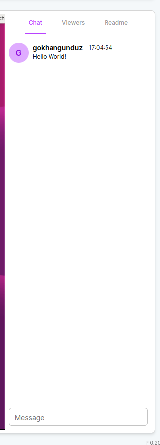
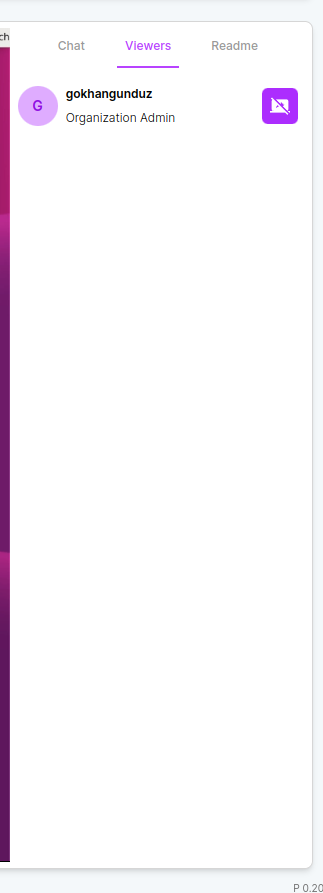

# Remote Desktop

## Remote Desktop

Remote Desktop allows you to remotely control the instance created for your application as if you were controlling your own computer.

##

Remote Desktop allows you to remotely control the instance created for your application as if you were controlling your own computer.

You can view and control the same screen with your team members. You can see who you are watching with, and even have instant conversations in the chat section.

## Remote Desktop Tabs

### Chat Tab

It is a tab that allows you to talk to your teammates while controlling the computer remotely.

### Viewers Tab

This is the tab where you can see who is here when you control the computer remotely with your teammates.

### ReadMe Tab

If the created application already has a ReadMe.md file, this is the tab where you can access the documents of your application.
