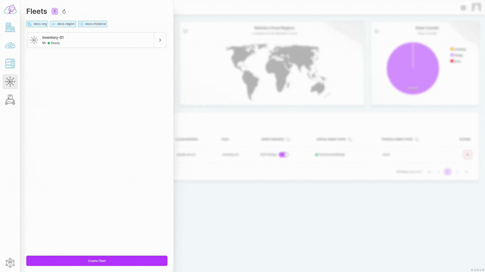
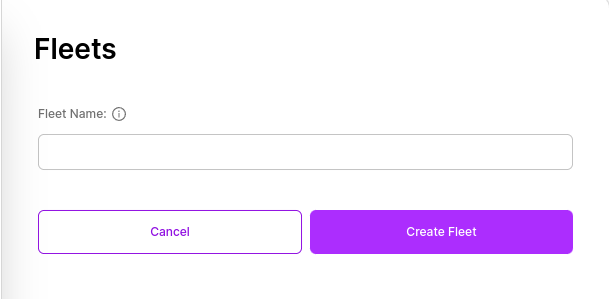

# Creatin a Fleet

## Creation Flow

To create a Fleet, all you need is to determine a Fleet name.

- Click on the "Fleet" button in the sidebar to open the list of Fleets. The current Fleets you have will be listed in the displayed tab.

- At the bottom of the opened tab, click on the "Create Fleet" button.

- If you receive a prompt asking you to select an Organization, Robotics Cloud, or Cloud Instance, you need to click on the desired object to determine under which Organization, Region, or Cloud Instance the Fleet will be located. After completing the selection process, click the "Create Fleet" button again.

- After clicking, enter your desired Fleet name in the "Fleet name" field in the form that appears.

- Finally, click on the "Create a new Fleet" button.

After clicking, you will be redirected to the Fleet list. In the displayed list, you can view the Fleet you created.
