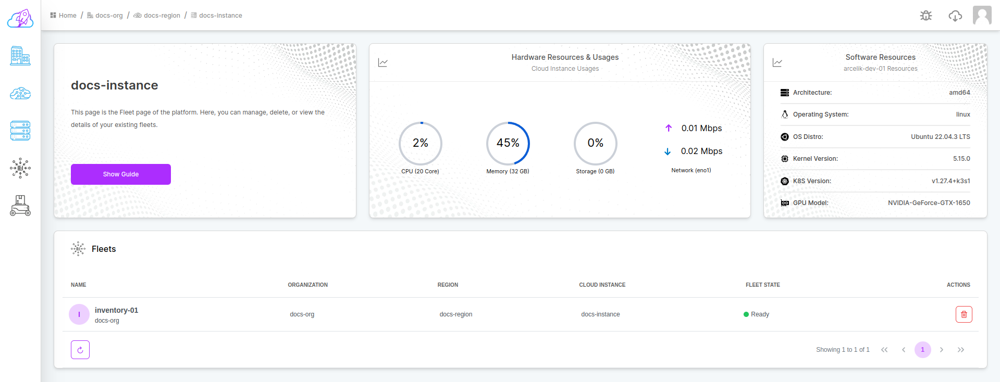
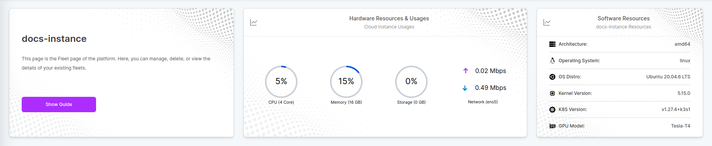
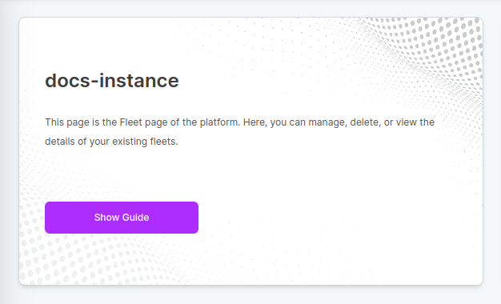
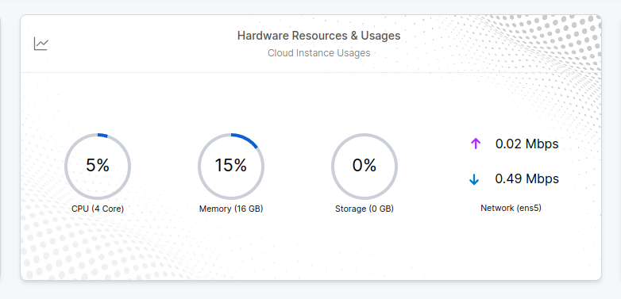
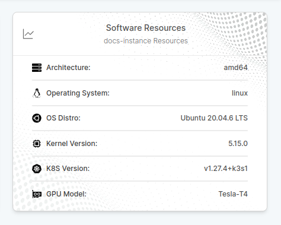
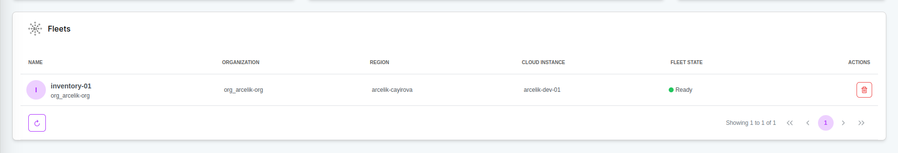

# Dashboard

The fleet dashboard provides detailed information about the fleets you have.

It basically consists of 2 sections. Widgets and general table.

## Widgets

Widgets provide information about objects on the dashboard.

### Information Widget

The information widget explains which objects are available on the current dashboard and how they can be managed. You can run the auxiliary guide on this subject with the `Show Guide` button.

### Hardware & Usages Widget

Hardware Widget is you can follow the usage statistics of the resources in your Instance.

### Software Widget

Software Widget is contains all the details like Kernel, OS, Kubernetes etc. available in your Instance.

## Table

General Table displays detailed information of existing objects. You can manage your objects with the `Actions` tab.
