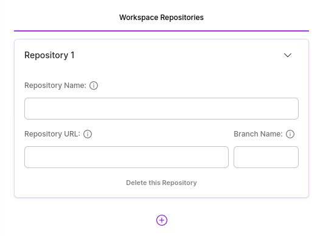
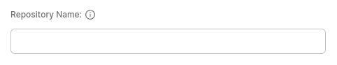
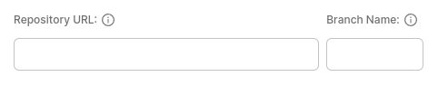

# Workspaces (Step 2)

The "Workspaces" form contains all the workspaces and repositories essential for creating your application within the robolaunch platform.

### Workspace Name
Specify a descriptive name for your workspace. Workspaces provide organized environments for different aspects of your application development, enabling efficient project management.

## Repositories
Add Git repositories that your application depends on. Repositories store and manage your project's source code and related files. Include all necessary repositories to ensure comprehensive access to your project's resources.

### Repository Name
Specify the name of the repository associated with the workspace. This name helps identify and link the repository to the designated workspace within your application.

### Repository URL
Specify the URL of the Git repository. The repository URL provides the location where the source code and project files are hosted. Ensure accurate URL details to establish a seamless connection to your repository.

### Repository Branch
Specify the branch of the Git repository you want to include. A branch represents a specific line of development within the repository. Selecting the appropriate branch ensures that your application utilizes the correct version of the source code.

These configurations collectively define the workspaces and repositories integral to your application's structure and functionality within the robolaunch platform.

Feel free to customize and manage these workspaces and repositories based on your project's requirements, facilitating collaborative development and streamlined version control for your application.