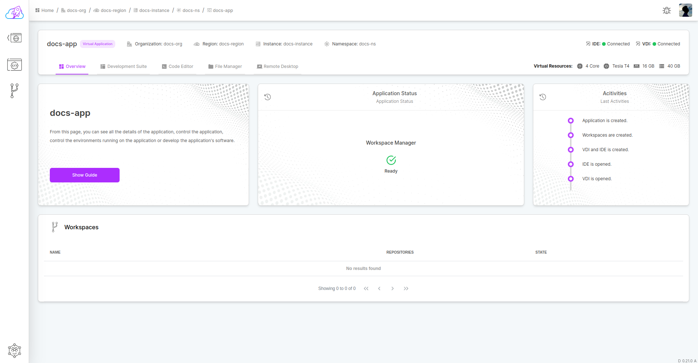
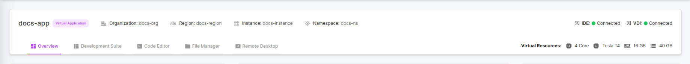
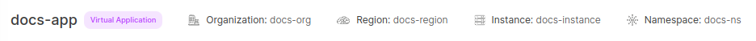
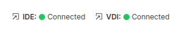
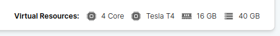
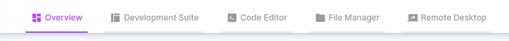

# Dashboard

The application dashboard provides detailed information about the applications you have.

It basically consists of 2 sections. Header and tab section.

## Header

Application header provides all detailed information about the application. It provides all information about the application, such as connection information, hardware resources information, as well as existing organization, region, instance and fleet data.

### Information

of current application you can see all the organization, region, instance and namespace values ​​on it, along with its name and type.

### Connection Status

You can check the status of the connection to VDI and IDE services in the background.

### Hardware Resources

You can view all hardware resources of your current application.

### Tabs

There are many services among the Application Tabs so you can control your application. You can control your application by accessing these services.

## Section

The services opened within the sections are visible. It is the area that takes over the management and control part.
