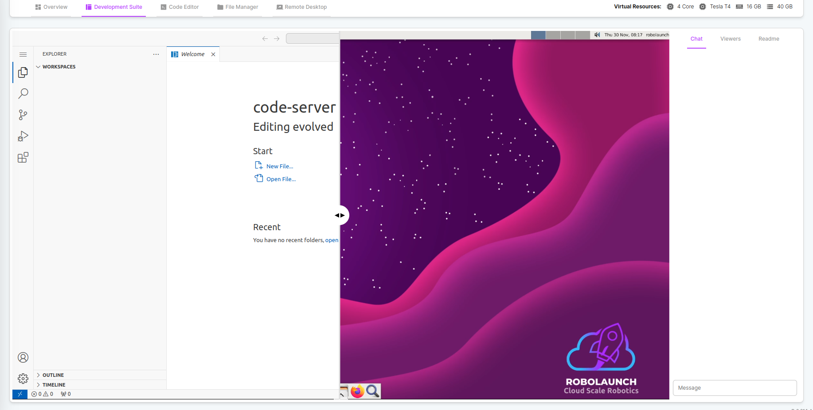
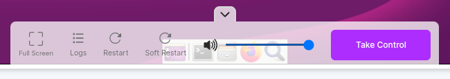
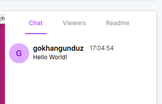
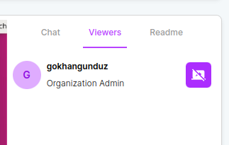
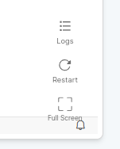

# Development Suite
The Development Suite is a synergistic integration of Cloud IDE (Integrated Development Environment) and Cloud VDI (Virtual Desktop Infrastructure) within robolaunch. This union elevates the development experience, offering robust coding tools and a virtual desktop environment, promoting smooth collaboration and effective project development.

## 1. Remote Desktop

Remote Desktop on robolaunch allows you to control your application instance remotely, offering a collaborative experience akin to controlling your local computer. This feature is particularly beneficial for team collaboration, enabling shared viewing and instant communication through the built-in chat section.

Remotely control your application instance, fostering collaborative work with your team.

### 1.1 Control Bar
Manage the streaming experience with controls like instance control, volume adjustment, restart options, and log review. 

### 1.2 Remote Desktop Tabs

Remote Desktop Tabs allows you to chat with your teammates, see who is watching this stream, and read the readme file of the current application.

#### 1.2.1 Chat Tab
Communicate with team members while remotely controlling the computer.

#### 1.2.2 Viewers Tab
Visual representation of team members present during remote control.

#### 1.2.3 ReadMe Tab

Access documentation if your application includes a ReadMe.md file.

## 2. Code Editor

The Code Editor is a crucial component for developing projects within workspaces in your application. It follows an MVC (Model-View-Controller) architecture, making collaborative development with your team seamless.

### 2.1 Cloud IDE
The IDE within the Code Editor provides a familiar environment, allowing for efficient project development in workspaces. Collaborate with your team to make improvements and enhancements.

### 2.2 Control Bar
- Trigger a soft or hard restart of the IDE service.
- Examine the log of the current service for effective debugging and troubleshooting.

This streamlined set of features in the Remote Desktop and Code Editor ensures a collaborative and efficient development experience within the robolaunch platform.