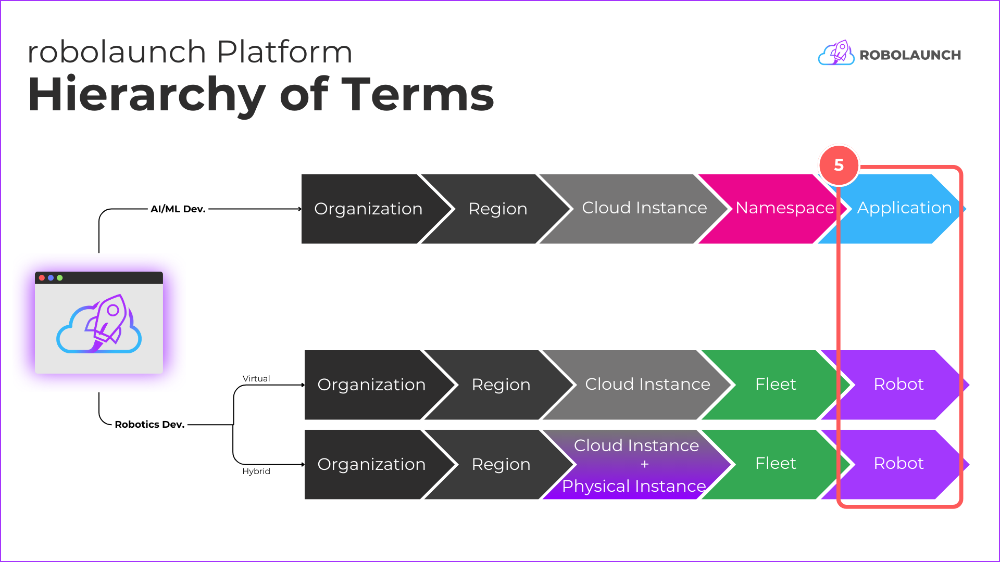

# Environment Overview

In the robolaunch platform, the term **Environment** encompasses the distinct use case types that can be developed and managed seamlessly. Two primary categories under the Environment umbrella are **Application** and **Robot**. Each represents a specific focus area for development, catering to the diverse needs of AI/ML and robotics projects.

## 1. Application Environment (AI/ML Projects)

The Application Environment is tailored for AI/ML development projects. Whether you're creating machine learning models, running data analytics, or deploying sophisticated AI applications, this environment provides the tools and resources needed for advanced computational tasks. Through a user-friendly interface, developers can effortlessly manage their AI/ML projects, ensuring efficient collaboration and streamlined workflows.

**Features:**

_will be added soon..._

## 2. Robot Environment (Robotics Projects)

The Robot Environment is designed to facilitate the development, training, and deployment of robotics applications. Whether you're working on simulation-based projects or real-world robotic deployments, this environment offers a comprehensive set of features for robotics engineers. From managing robotic fleets to coordinating tasks and monitoring performance, the Robot Environment empowers teams to bring their robotic solutions to life.

**Features:**

- **Containerized ROS 2 environment:**

    - Robot provisions a containerized environment with ROS 2, providing a standardized and portable framework for developing and running robotics applications.

    - Robot ensures consistency and compatibility by providing a standardized ROS 2 environment across cloud and physical infrastructure. This simplifies development, deployment, and interoperability of robotics applications.

- **ROS 2 Bridge Connectivity:**

    -  Robot includes ROS 2 bridge connectivity, facilitating communication with other ROS-based systems and components, both within the same Fleet and with external systems.

- **Cloud VDI (Remote Desktop):**

    - Robot offers integration with a cloud-based Virtual Desktop Infrastructure, providing a remote desktop environment for visualization and control of robotics applications.

- **Cloud IDE (Code Editor):**

    - Robot provides integration with a cloud-based Integrated Development Environment, allowing developers to remotely write, test, and debug robotics applications.

- **Remote IDE:**

    - Robot provisions a remote code editor on the Physical Instance when deploying the robot. This allows users to remotely access and edit the robot's source code, facilitating convenient development, debugging, and customization directly on the physical hardware.

- **Teleoperation:**

    - Robot includes teleoperation capabilities, allowing users to remotely control and operate the robot from the robolaunch Cloud Robotics Platform. This enables real-time control and interaction with the robot across cloud and physical infrastructure.

- **Visualization:**

    - Robot supports ROS 2 topics and tools like rViz for data visualization. Users can visualize sensor data, robot state information, and other relevant data streams in real-time, aiding in understanding and analysis of the robot's behavior. (can be extended)

## Conclusion

In summary, the Environment section in robolaunch serves as a gateway to tailored development experiences. It accommodates the unique requirements of AI/ML and robotics projects, fostering innovation, collaboration, and efficiency within a unified platform.

