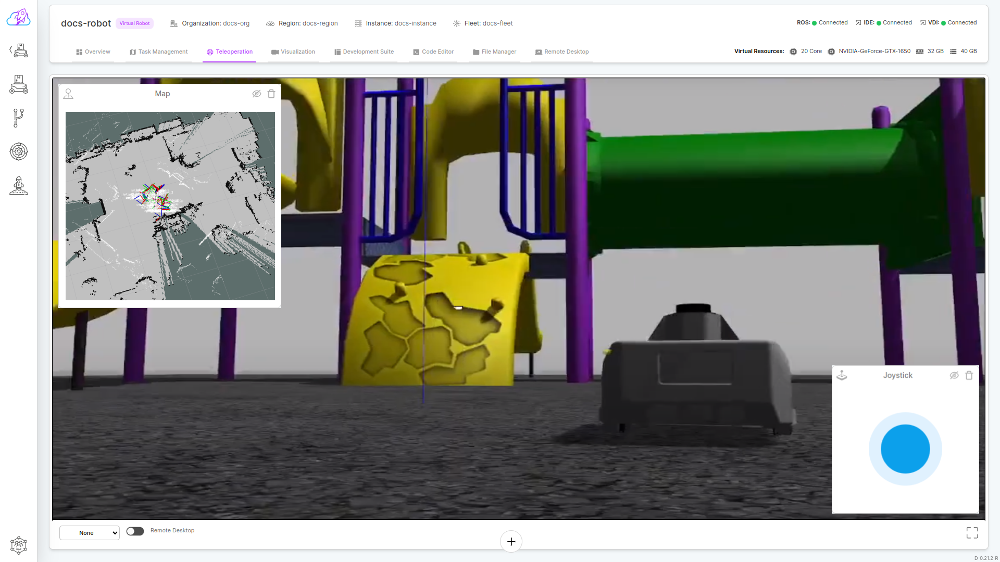
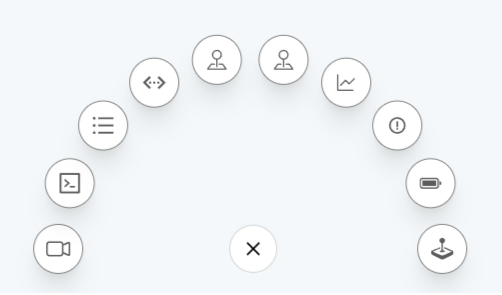

# Teleoperation
The Teleoperation tab is your comprehensive control center for managing and monitoring your robot in real-time. From controlling its movements to visualizing its data, this central hub equips you with everything needed for remote and efficient robot operation.

## Display
 Gain direct access and control of the instance created for your application. Imagine viewing your robot's environment as if you were physically present, interacting with its software and functionalities just like you would on your own computer. 

## Widgets
Immerse yourself in a world of data with customizable widgets. Choose the specific information you need, whether it be motor performance, sensor readings, or environmental conditions, and see it displayed in clear and informative graphs and charts.

### Joystick Widget
Take your robot on adventures with the intuitive joystick widget. Manoeuvre it through its environment, navigate around obstacles, and perform precise movements, all from the comfort of your remote location.

### Camera Widget
See the world through the eyes of your robot. Live video feed from the mounted camera provides real-time visual feedback of its surroundings, allowing you to make informed decisions about its movements and actions. 

### cmd_vel Logs Widget
Dive deep into the inner workings of your robot with the cmd_vel logs widget. This powerful tool displays the 'cmd_vel' topic data from the ROS/ROS2 system, offering detailed insights into the robot's velocity commands, enabling troubleshooting and performance analysis.

## Topic List Widget
Explore the vast universe of ROS/ROS2 topics available on your robot. Discover and interact with data streams beyond those provided by the default widgets, unlocking advanced functionality and customization. 

### ros_out Logs Widget
Keep your finger on the pulse of your robot with ros_out logs. This widget monitors the 'ros_out' topic, displaying messages and logs published by the ROS/ROS2 system, providing valuable insights into the robot's internal state and potential debugging clues.

### Map Widget
Never lose your way. The interactive map widget displays an instant map image scanned by the ROS system on your robot, providing crucial context for understanding its location and surroundings. 

### Network Widget
Monitor the lifeblood of your robot – its network. Track data usage and bandwidth consumption in real-time, identify potential network issues, and optimize performance for smooth and reliable operation.

### Resources Widget
Ensure your robot has the fuel it needs to perform. The resource widget displays CPU, memory, and disk usage data, allowing you to monitor resource consumption and prevent potential bottlenecks or crashes.

### Emergency Widget
Safety first. In case of unforeseen situations, the emergency stop widget allows you to instantly halt your robot's movement, preventing any harm or damage.

### Battery Widget
Stay informed about your robot's energy levels. The battery widget displays the remaining battery life, allowing you to plan your operations accordingly and avoid unexpected interruptions.

---

With its comprehensive features and intuitive interface, the Teleoperation tab empowers you to remotely control and monitor your robot with confidence and ease. Take control, explore its capabilities, and unlock the full potential of your robotic ally.