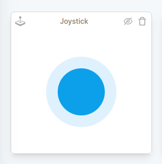
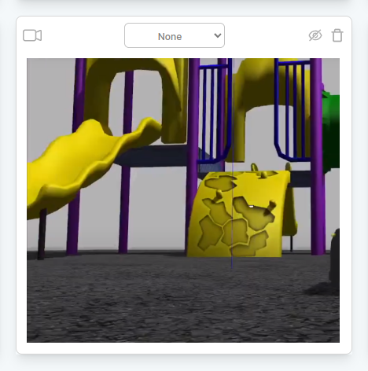
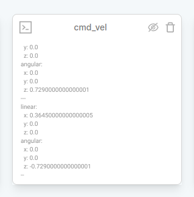
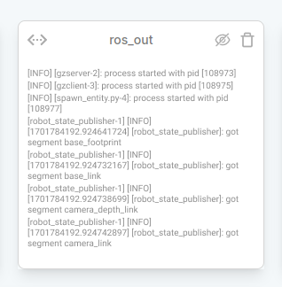
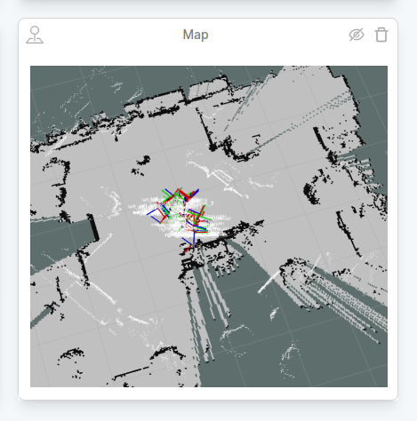
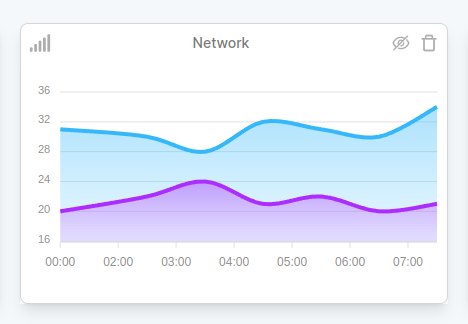
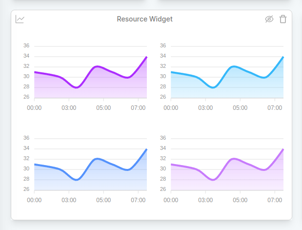
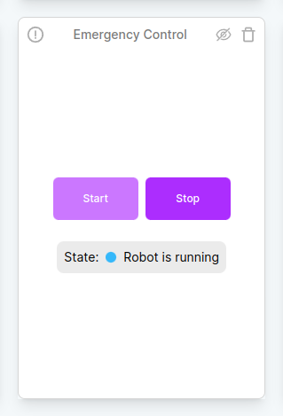
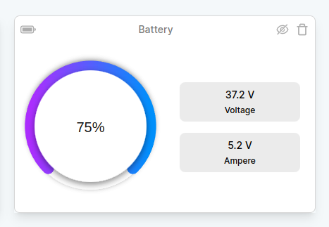

# Teleoperation

## Widgets

Data can be visualized and teleoperation via widgets in the Teleoperation Tab. Data can be monitored according to the widget tab.

### Joystick Widget

Joystick Wiget allows controlling the robot.

### Camera Widget

Camera Widget provides snapshots of the camera located on the robot.

### cmd_vel Logs Widget

cmd_vel Logs listens to the 'cmd_vel' topic in ROS/ROS2 running on the robot.

## Topic List Widget

Topic List, provides to ROS/ROS2 topic list at robot.

### ros_out Logs Widget

ros_out Logs listens to the 'ros_out' topic in ROS/ROS2 running on the robot.

### Map Widget

Map Widget is an instant map image scanned by ros on the robot.

### Network Widget

Network Widget presents the network values ​​consumed by the robot instantly.

### Resources Widget

Resources Widget shows the values ​​consumed by the robot instantly.

### Emergency Widget

Emergency Widget is used to stop the robot in case of emergency intervention.

### Battery Widget

Battery Widget allows you to check the robot's battery.
