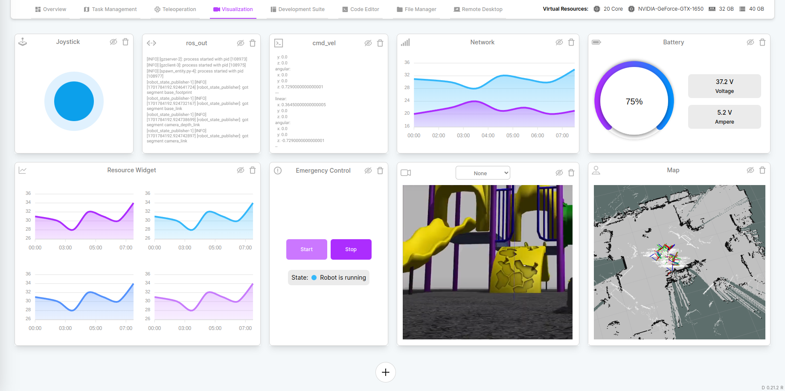

# Visualization
Unlock the power of data visualization and gain instant insights into your robot's performance. The Visualization tab is your window into the inner workings of your robotic companion, providing real-time data visualization that empowers you to make informed decisions and optimize your robot's operation.

## Widgets
Data visualization is facilitated through widgets within the visualization tab. Each widget corresponds to specific aspects of the robot's data, offering a comprehensive monitoring experience.

### Camera Widget
The Camera Widget offers snapshots captured by the camera installed on the robot, providing visual insights into its surroundings.

### cmd_vel Logs Widget
The cmd_vel Logs Widget actively monitors the 'cmd_vel' topic in ROS/ROS2, offering a detailed log of velocity commands crucial for robot movement.

## Topic List Widget
The Topic List Widget provides a comprehensive list of ROS/ROS2 topics currently active on the robot, offering a detailed overview of communication channels.

### ros_out Logs Widget
The ros_out Logs Widget tracks the 'ros_out' topic in ROS/ROS2, presenting a detailed log of system messages generated by the robot.

### Map Widget
The Map Widget delivers an instant map image generated by ROS on the robot, providing a visual representation of its surroundings.

### Network Widget
The Network Widget offers real-time insights into the network values consumed by the robot, allowing users to monitor network performance.

### Resources Widget
The Resources Widget displays real-time values depicting resource consumption by the robot, offering a quick overview of its operational load.

### Emergency Widget
The Emergency Widget serves as a critical tool for emergency interventions, providing a mechanism to swiftly stop the robot when necessary.

### Battery Widget
The Battery Widget allows users to check the current battery status of the robot, ensuring optimal power management.

### Joystick Widget
The Joystick Widget facilitates manual control of the robot, providing an interactive interface for users to navigate and operate the robot with precision.

