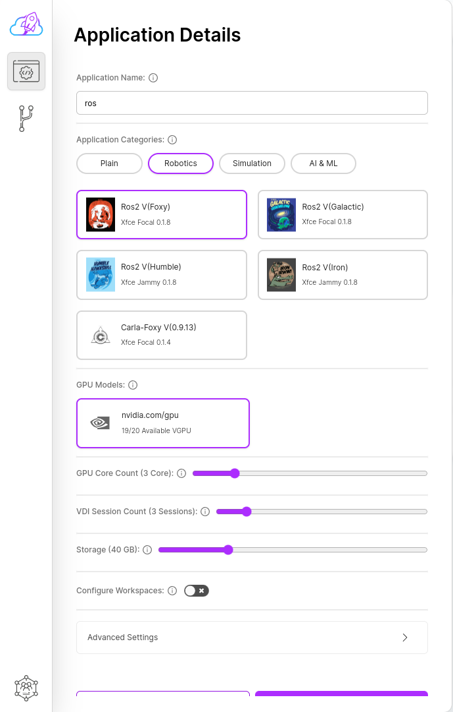

# ROS

[ROS (Robot Operating System)](https://www.ros.org/) is an open-source middleware platform designed to facilitate the development of robotic software. It provides a robust and flexible framework for building complex and distributed robot applications. With ROS, you can easily create and connect various nodes, each responsible for specific tasks, enabling smooth and efficient robot operation.

## Create a ROS Application in Just a Few Clicks
robolaunch makes it simple to get started with ROS. Forget about manual installations and configuration complexities. robolaunch takes care of everything for you, offering a pre-configured ROS environment ready to use in the cloud.

## Here's how to create a ROS application on robolaunch:
- Click the **Application** button on the sidebar to open the list of applications.
- Click the **Create Application** button at the bottom of the screen.
- If prompted, choose the **Organization**, **Region**, **Cloud Instance**, and **Fleet** where you want to create the application.
- Enter your desired application name in the **Application name** field.
- Select the **Robotics** category and your preferred ROS distribution version.
- Fill in the remaining fields as needed.
- Click the **Create Application** button.

Upon clicking the Create Application button, robolaunch automatically sets up a ROS environment for you in the cloud. This environment includes all the necessary ROS packages and tools, allowing you to start developing your robot application immediately.

## Example Use Cases:

- Develop robot control and navigation algorithms
- Implement perception and sensor processing tasks
- Connect and interact with various sensors and actuators
- Create robotic simulations and test environments

## Why Choose robolaunch for ROS Development?

- **Convenience:** robolaunch eliminates the need for manual setup, simplifying your ROS development process.
- **Scalability:** Easily scale your ROS environment to meet your project's needs with robolaunch's powerful cloud resources.
- **Collaboration:** robolaunch facilitates seamless collaboration with your team on ROS applications.
- **GPU Acceleration:** Leverage the power of GPUs for accelerated ROS simulations and development tasks.
- **Cloud-based Development:** Enjoy a flexible and accessible development environment with robolaunch's cloud platform.