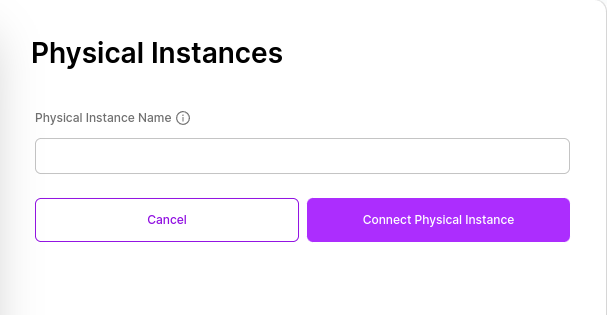
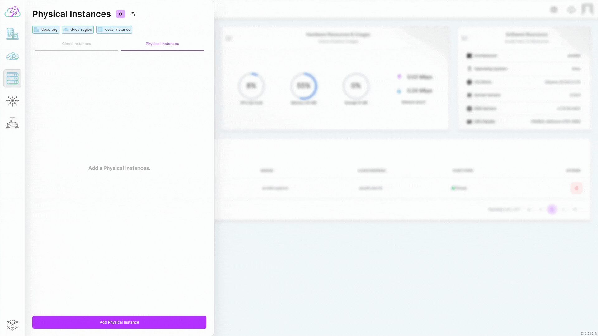

# Creating Instances

## Creating a Cloud Instance

Before you embark on your AI/ML development or robotics journey, explore the video below for a step-by-step guide on creating Cloud Instances within the robolaunch platform. Witness how seamlessly you can provision and manage virtual machines, leveraging the platform's scalable infrastructure and GPU capabilities. From allocating resources to orchestrating containers, this walkthrough provides insights into the robust features that empower your development endeavors. Dive into the video to streamline your Cloud Instance creation process and enhance your capabilities in the world of AI and robotics development.

### Cloud Instance Creation Flow

To create a Cloud Instance, all you need is to determine a Cloud Instance name.

- Click on the "Instances" button in the sidebar to open the list of Cloud Instances. The current Cloud Instances you have will be listed in the displayed tab.

- At the bottom of the opened tab, click on the "Create a Cloud Instance" button.

- If you receive a prompt asking you to select an Organization or Region, you need to click on the desired object to determine under which Organization or Region the Cloud Instance will be located. After completing the selection process, click the "Create a Cloud Instance" button again.

- After clicking, enter your desired Cloud Instance name in the "Cloud Instance name" field in the form that appears.

- After clicking, select Cloud Instance resource type.

- Finally, click on the "Create a new Cloud Instance" button.

After clicking, you will be redirected to the Cloud Instance list. In the displayed list, you can view the Cloud Instance you created.

## Creating a Physical Instance
Integrate your physical instance seamlessly with the cloud instances that power your robots through Robolaunch. A Physical Instance, in the context of Robolaunch, refers to a tangible device like a single board computer or robot that seamlessly integrates into the Robotics Cloud platform. This integration is achieved by running a script, establishing a connection with the platform for remote management, monitoring, and application deployment. The process typically takes just a few minutes, allowing you to swiftly incorporate the Physical Instance into your robotics ecosystem.

### Physical Instance Creation Flow
Adding a Physical Instance to your setup is a streamlined process:

- Navigate to the "Instances" button in the sidebar, accessing the list of Cloud Instances. Click on the 'Physical Instances' tab at the top bar to view existing physical instances.

- At the bottom of the opened tab, locate and click the "Add Physical Instance" button.

- Fill in your desired physical instance name in the "Physical instance name" field in the appearing form.

- Complete the process by clicking the "Add Physical Instance" button.

Upon completion, a shell code for connections will be generated. Copy the clipboard code and paste it into the bash terminals of your Physical Instance.

This efficient integration allows you to centrally manage and coordinate the Physical Instance alongside Cloud Instances. Harness its computing power and sensory inputs to enhance the performance and capabilities of your robotics operations.
