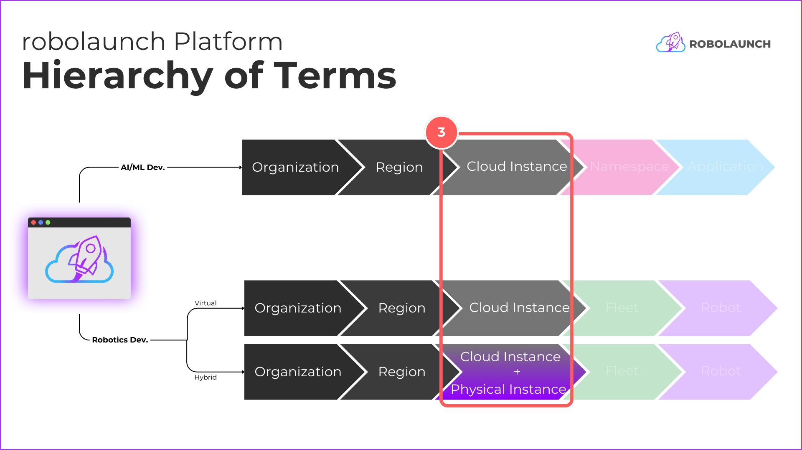
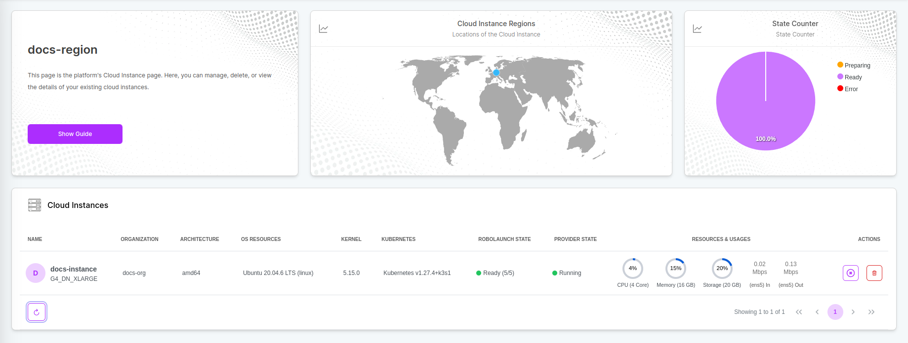
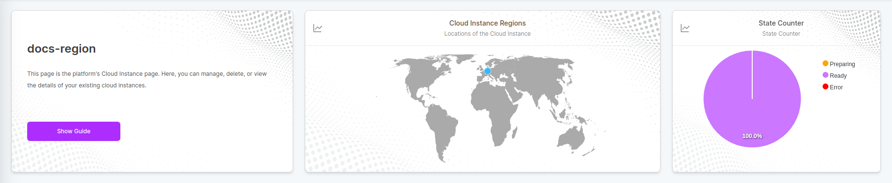
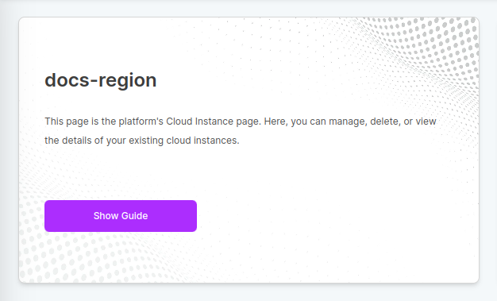
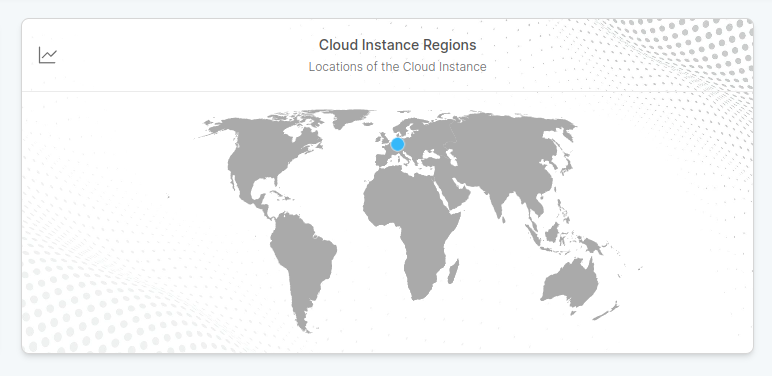
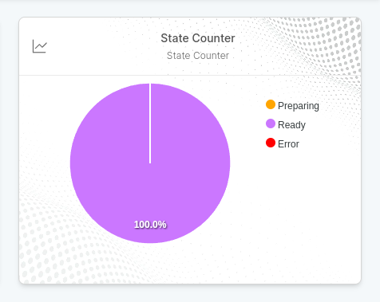
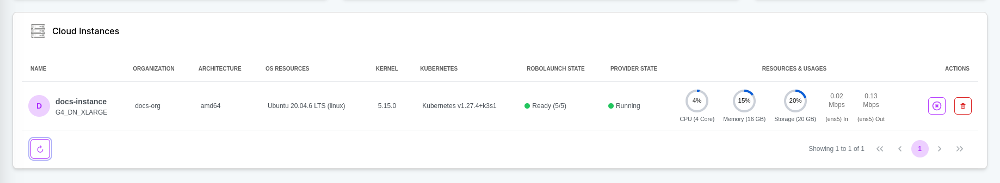

# Overview
The "Instance" section of the robolaunch platform encompasses two main types: "Cloud Instances" and "Physical Instances". The choice between these instances is driven by the specific requirements of your robotics and AI/ML projects.

**Cloud Instances:**

- **_Applicable Use Cases:_** Essential for AI/ML development and integral to various robotics scenarios, including simulations and physical robotics operations.
- **_Key Features:_** GPU capabilities, scalable infrastructure, containerization, and orchestration support.

**Physical Instances:**

- **_Applicable Use Cases:_** Specifically designed for real-world robotics deployments and scenarios where a physical presence is required.
- **_Key Features:_**  Seamless integration with physical devices, remote management, sensor integration, and synchronization with Cloud Instances.

These instance types cater to a spectrum of use cases, providing the flexibility to choose the computing resources that align with the demands of your specific AI and robotics development projects. Now, let's delve into the details of each instance type.

## Cloud Instance
A Cloud Instance is a virtual machine within the Region, providing dedicated computing resources for robotics operations. It empowers users to harness scalable infrastructure in the cloud, including GPU capabilities, for tasks such as sensor analysis, AI/ML operations using robot sensors, and other compute-intensive operations.

**Features:**

- **Application Development & Deployment:** Deployment and management of robotics and AI/ML applications on both Cloud Instances and Physical Instances. Version control, automated deployment, rollbacks, and application monitoring.
- **Data Management:** Features for managing data generated by robotics &AI applications, including storage, processing, real-time streaming, and analytics. Data synchronization and sharing between Cloud Instances and Physical Instances.
- **GPU Capabilities:** Support for GPU resources within Cloud Instances for GPU-intensive operations. Features to allocate, configure, and utilize GPU resources effectively.
- **Containerization and Orchestration:** Support for containerization technologies (e.g., Docker) and orchestration platforms (e.g., Kubernetes). Efficient management and scaling of containers within Cloud Instances.
- **Data Processing & Analytics:** Capabilities for data processing and analytics within Cloud Instances. Real-time data ingestion, transformation, advanced analytics, and visualization.
- **Connectivity:** Features for managing connectivity between Cloud Instances and Physical Instances. Configuration of network interfaces, setting up secure communication channels, and ensuring reliable data transfer.

## Physical Instance
A Physical Instance refers to a tangible device, such as a single-board computer or robot, seamlessly integrated into the Robotics Cloud platform. Through a script, the Physical Instance establishes a connection with the platform, enabling remote management, monitoring, and application deployment.

**Features:**

- **Integration with One Script:** Seamless integration of Physical Instances into the Robotics Cloud platform by running a script. Quick onboarding and connection establishment between the Physical Instance and the platform.
- **Remote Management:** Features for remotely managing and controlling the Physical Instance from the platform. Remote command execution, firmware updates, configuration changes, and software deployment.
- **Monitoring and Health Checks:** Monitoring of the Physical Instance's health and status through the platform. Real-time monitoring of vital metrics, sensor data, and connectivity status.
- **ROS 2 Application Deployment:** Facilitation of application deployment and software updates onto the Physical Instance from the platform.
- **Synchronization with Cloud Instances:** Synchronization and coordination between the Physical Instance and Cloud Instances. Data sharing, task coordination, and collaborative workflows.
- **Sensor Integration:** Support for integration with various sensors and peripherals connected to the Physical Instance. Provision of APIs, drivers, and frameworks to access and utilize sensor data.
- **Security and Access Control:** Implementation of robust security measures, including authentication, authorization, and encryption. Secure access to the Physical Instance and protection of sensitive data and communications.
- **Lifecycle Management:** Features for managing the lifecycle of the Physical Instance within the platform. Provisioning, deprovisioning, retiring, and reallocating resources as needed.

# Navigating Instance Dashboard

The instance dashboard provides detailed information about the instances you have. It basically consists of 2 sections. Widgets and general view.

## Widgets

Widgets provide information about objects on the dashboard.

### Information Widget

The information widget explains which objects are available on the current dashboard and how they can be managed. You can run the auxiliary guide on this subject with the `Show Guide` button.

### Instance Regions

Instance Widget is maps the locations of instances created in providers.

### State Widget

State Widget is a pie widget that visualizes the states of current objects and possible errors.

## Table

General Table displays detailed information of existing objects. You can manage your objects with the `Actions` tab.
