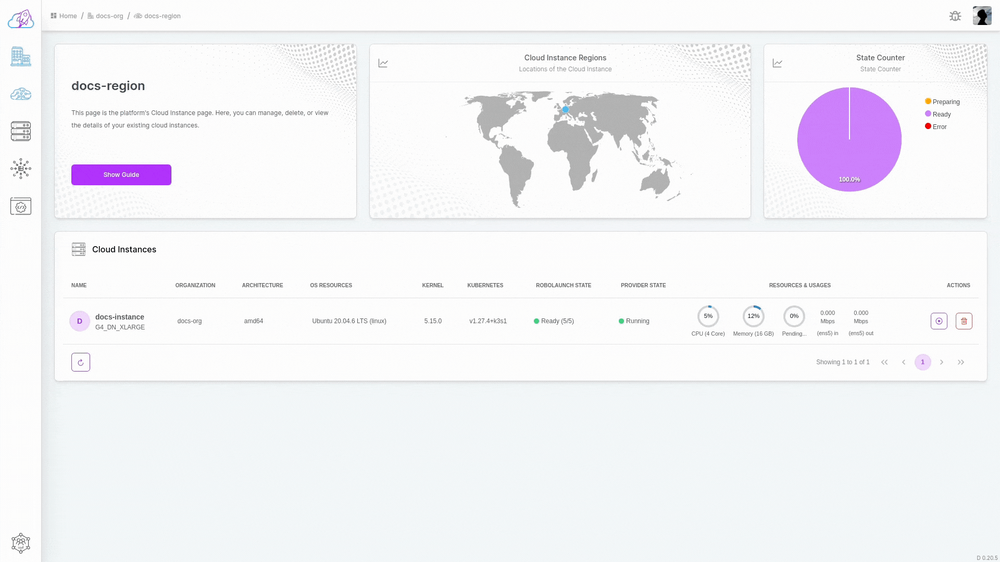

# Delete

Prepare to refine your AI/ML development or robotics operations with the video guide below. Learn the step-by-step process of deleting a Cloud Instance within the robolaunch platform. Whether optimizing resources or reshaping your deployment strategy, this walkthrough will guide you through the simple steps needed to remove a specific instance. From initiating the delete command to confirming your action, gain valuable insights into managing your computing resources efficiently. Dive into the video to discover how to effortlessly delete an Instance and enhance your capabilities in AI and robotics development.

## Deletion Flow

Ready to remove an instance from your roster? Follow the simple steps below to delete a Cloud Instance within the robolaunch platform.

- **1. Navigate to the Instances Dashboard:** Go to the dashboard where your instances are located. (Access by clicking the region icon in the sidebar and selecting the > button on any item.)
- **2. Initiate Delete Command:** Click on the button with the delete icon on the right side of the opened table rows corresponding to the desired Instance.
- **3. Confirm Action:** After clicking, confirm the action through the popup that appears.

Congratulations! You've successfully deleted your Cloud Instance. The instance chart is now refreshed, providing a clear view of your existing instances as you continue managing your computing resources for AI and robotics development.
