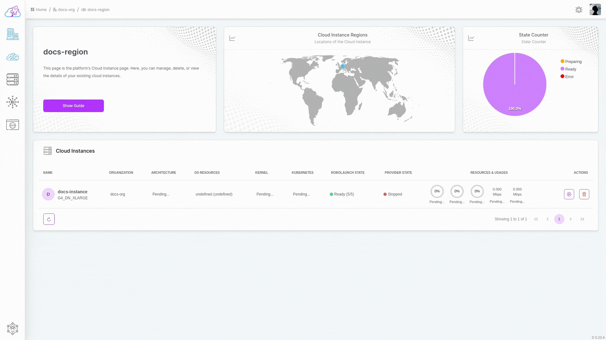

# Starting Instance
Embark on your AI/ML development or robotics operations journey with the video guide below. Learn how to seamlessly start a Cloud Instance within the robolaunch platform directly from the Instance dashboard. Navigate to the list of Instances, locate the specific instance you wish to activate, and make your selection. This step-by-step walkthrough illustrates the straightforward process of initiating the start command and monitoring the instance's status. 

## Starting Steps
 Follow the simple steps below to start your instance within the robolaunch platform.

- **1. Navigate to the Instances Dashboard:** Go to the dashboard where your instances are located. (Access by clicking the region icon in the sidebar and selecting the > button on any item.)
- **2. Initiate Start Command:** Click on the button with the start icon on the right side of the opened table rows corresponding to the desired Instance.
- **3. Confirm Action:** After clicking, confirm the action through the popup that appears.
- **4. Refresh and View Instances:** Upon confirmation, the instance chart will be refreshed. View existing instances in the displayed table to ensure the successful start of the selected Instance.

Congratulations! You've successfully started your Cloud Instance. The instance chart is now refreshed, allowing you to seamlessly continue your AI and robotics operations.