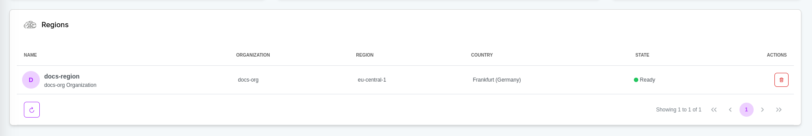

# Overview

A Region in the robolaunch platform empowers your organization to seamlessly provision and manage computing resources, catering to both Cloud Instances and Physical Instances (if any), in a unified cloud-based platform. This flexible infrastructure facilitates the integration of virtual machines (Cloud Instances) for AI and robotics development and connects them with single board computers and robots (Physical Instances) through a secure network.

**Features:**

- **Cloud Instance management:** Facilitate the provisioning and management of Cloud Instances, dedicated virtual machines for both robotics and AI operations. Features include creating, scaling, and terminating instances, along with monitoring health and performance.
- **Physical Instance management:** Enable management of Physical Instances, encompassing single board computers or robots deployed in the field. Features include remote monitoring, software updates, and deploying/managing applications on these devices.

- **Network connectivity:** Ensure robust and secure network connectivity between Cloud Instances and Physical Instances. Features encompass establishing secure communication channels, managing networking configurations, and handling data transfer between instances.

- **Kubernetes orchestration:** Leverage Kubernetes for containerized application deployment, management, and scaling across both Cloud Instances and Physical Instances. Features include deploying containers, managing pods and services, load balancing, and ensuring high availability.

# Navigating Region Dashboard
The region dashboard provides detailed information about the regions you have. It basically consists of 2 sections. Widgets and general view:

## Widgets

Widgets provide information about objects on the dashboard.

### Information Widget

The information widget explains which objects are available on the current dashboard and how they can be managed. You can run the auxiliary guide on this subject with the `Show Guide` button.

### Provider Regions

Provider Regions Widget is maps the locations of instances created in cloud providers.

### State Widget

State Widget is a pie widget that visualizes the states of current objects and possible errors.

## Table

General Table displays detailed information of existing objects. You can manage your objects with the `Actions` tab.