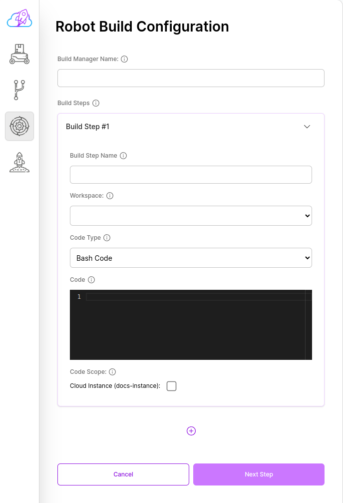
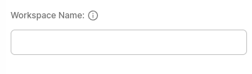

# Build Manager (Step 3)

Workspaces form is the form that contains all the workspaces and repositories of your application to be created.

### Build Name

You can specify the name of your build here.
