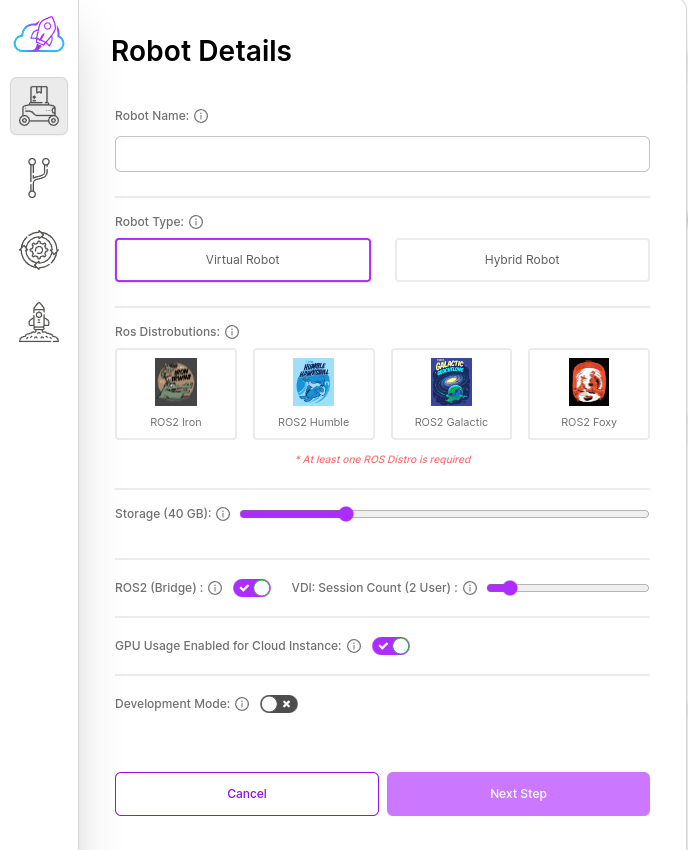
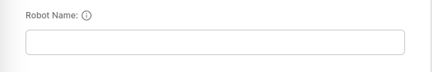
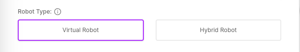
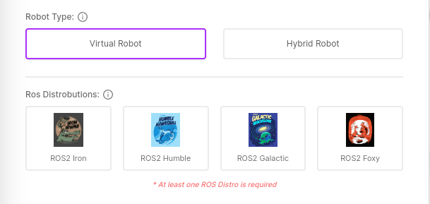
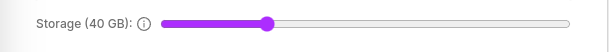
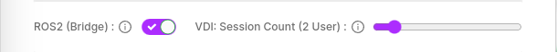
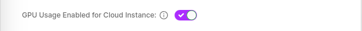

# Details (Step 1)

Details form is the form that contains all the main settings and configurations of your robot to be created.

### Robot Name

You can specify the name of your robot here.

### Robot Type

You can choose the robot types.

### ROS Distros

You can choose the ROS distro here.

### Storage

You can determine how much storage space will be allocated for your robot here.

### ROS2 Bridge

You can determine whether the Ros bridge is closed or open here. Bridge is required Teleoperation and Visualization.

### VDI Session Count

Here you can determine how many people can connect to your robot's VDI service at the same time.

### GPU Enabled for Cloud Instance

You can determine whether the GPU is closed or open here.

### Development Mode

You can determine whether the development mode is closed or open here.
